 

<a href="#about">ABOUT</a> ·
<a href="#services">SERVICES</a> ·
<a href="#technologies">TECHNOLOGIES</a> ·
<a href="#work">WORK</a> ·
<a href="#contact">CONTACT</a>

 

<h2 id="about">ENGINEERING THE DIGITAL FUTURE</h2>

ZUBO is a multidisciplinary software and technology company. We bring together
engineering, design, artificial intelligence, automation, cloud, cybersecurity,
data and digital strategy under a single team — so businesses can turn ideas
into real, working technology without stitching together five different vendors.

We design, engineer, deploy and scale digital solutions across the complete
technology lifecycle:

`IDEA` → `STRATEGY` → `DESIGN` → `DEVELOPMENT` → `DEPLOYMENT` → `OPTIMIZATION` → `GROWTH`

 

<table>
<tr>
<td width="33%" valign="top">

**`01`  SOFTWARE-FIRST**
We don't just build websites — we engineer software: backends, APIs,
infrastructure and systems designed to scale.

</td>
<td width="33%" valign="top">

**`02`  MULTIDISCIPLINARY**
Design, engineering, AI, automation, data and security working from the
same roadmap — not disconnected freelancers.

</td>
<td width="33%" valign="top">

**`03`  BUILT TO LAST**
Clean architecture, documented systems and maintainable code — built for
teams who'll still be using it in three years.

</td>
</tr>
</table>

<h2 id="services">WHAT WE BUILD</h2>

<table>
<tr>
<td valign="top" width="50%">

**SOFTWARE ENGINEERING**
- Custom Software
- Enterprise Applications
- SaaS Platforms
- API Development
- Backend Systems

**WEB**
- Websites & Web Applications
- E-commerce
- CMS
- Progressive Web Apps

**MOBILE**
- Android · iOS
- Flutter · React Native
- Cross-platform Apps

</td>
<td valign="top" width="50%">

**AI & AUTOMATION**
- AI Applications & AI Agents
- Machine Learning · Generative AI
- Business & Workflow Automation
- RAG Systems

**CLOUD & INFRASTRUCTURE**
- Cloud Architecture · DevOps
- CI/CD · Docker · Kubernetes
- Server Infrastructure & Monitoring

**DATA & SECURITY**
- Data Engineering & Analytics
- Databases · Authentication
- Cybersecurity & Security Architecture

</td>
</tr>
</table>

**DESIGN & DIGITAL** — UI/UX · Product Design · Branding · Digital Strategy · SEO · Digital Marketing

<h2 id="technologies">TECHNOLOGY ECOSYSTEM</h2>

<b>LANGUAGES</b>

 

<b>FRONTEND</b>

 

<b>BACKEND</b>

 

<b>MOBILE</b>

 

<b>AI / ML</b>

 

`LLMs` · `Computer Vision` · `NLP` · `RAG` · `AI Agents`

<b>DATABASE</b>

 

<b>CLOUD / DEVOPS</b>

 

<b>DESIGN &amp; TOOLS</b>

 

<h2>HOW WE BUILD</h2>

| | | |
|:---|:---|:---|
| `01` **DISCOVER** | Understand the business, users and requirements. | |
| `02` **STRATEGIZE** | Define architecture, technology and roadmap. | |
| `03` **DESIGN** | Create user experiences and product systems. | |
| `04` **ENGINEER** | Build scalable and maintainable technology. | |
| `05` **TEST** | Validate quality, security and performance. | |
| `06` **DEPLOY** | Launch production-ready systems. | |
| `07` **OPTIMIZE** | Monitor, improve and scale. | |

<h2 id="work">SELECTED WORK</h2>

<table>
<tr>
<th align="left">PROJECT</th>
<th align="left">CATEGORY</th>
<th align="left">STACK</th>
<th align="left">OUTCOME</th>
</tr>
<tr>
<td><b>ZUBO AI Lead Generator</b> Intelligent lead-generation and outreach automation.</td>
<td>AI · Automation · SaaS</td>
<td><code>Node.js</code> <code>OpenAI</code> <code>PostgreSQL</code></td>
<td>Replace with real result</td>
</tr>
<tr>
<td><b>Project Name</b> One-line description of the problem it solves.</td>
<td>Category</td>
<td><code>Stack</code></td>
<td>Outcome</td>
</tr>
<tr>
<td><b>Project Name</b> One-line description of the problem it solves.</td>
<td>Category</td>
<td><code>Stack</code></td>
<td>Outcome</td>
</tr>
</table>

Replace these rows with real projects/repos as they ship.

<h2>ENGINEERING PRINCIPLES</h2>

<table>
<tr>
<td align="center" width="25%">🔷 <b>Scalable by Design</b></td>
<td align="center" width="25%">🔷 <b>Security First</b></td>
<td align="center" width="25%">🔷 <b>Performance Driven</b></td>
<td align="center" width="25%">🔷 <b>User Centric</b></td>
</tr>
<tr>
<td align="center" width="25%">🔷 <b>Automation First</b></td>
<td align="center" width="25%">🔷 <b>Clean Architecture</b></td>
<td align="center" width="25%">🔷 <b>Maintainable Code</b></td>
<td align="center" width="25%">🔷 <b>Continuous Improvement</b></td>
</tr>
</table>

<h2>ACTIVITY</h2>

Replace <code>ZUBO-GITHUB-USERNAME</code> with the org/account this profile belongs to.

<h2 id="contact" align="center">HAVE AN IDEA?</h2>

<b>BUILD IT WITH ZUBO.</b> 
Let's turn your idea into a reliable, scalable digital product.

 

**ZUBO**
BUILD WHAT'S NEXT.
Software · AI · Automation · Web · Mobile · Cloud · Digital

© ZUBO. All rights reserved.

